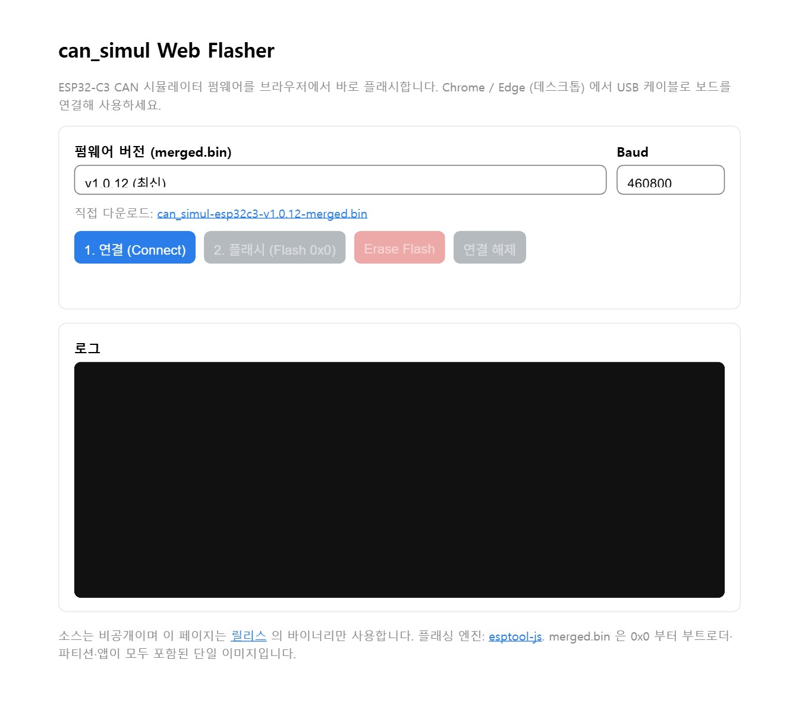

| ESP-IDF Version | v5.5.2 |
| --------------- | ------ |

# CAN Simulator (OBD-II / WWH-OBD / J1939)

ESP32-C3 기반 차량 진단 CAN 시뮬레이터. ISO 15765-4 (11-bit / 29-bit, 500 kbps)
OBD-II, WWH-OBD(ISO 27145), J1939 프로토콜을 에뮬레이션한다.

> Arduino 프로젝트(`OBD-II-SIMDTC_WWH_MERGED.ino`)를 ESP-IDF v5.5.2 로 이식한 것으로,
> 동작/응답 로직은 원본과 동일하며 CLI 는 `esp_console` REPL 로 재구성되었다.
> 원본 Arduino 명령 문법은 `o` 접두 명령으로 100% 호환 지원한다.

> ⚠️ **Lab use only. 실차 CAN 버스에 연결하지 말 것.**

> 이 저장소는 **배포용**입니다. 소스 코드는 비공개이며 빌드된 펌웨어 바이너리만 배포합니다.
> 버전별 명령어 등 상세 사용법은 각 [Releases](../../releases) 페이지 본문(운용자 매뉴얼)을 참고하세요.

## 기능

- **OBD-II** : Mode 01(supported PID bitmap + 각종 PID), Mode 03/04(DTC), Mode 09(VIN, ISO-TP)
- **WWH-OBD** : Service 0x22(DID 테이블 + 계산 DID + supported 마스크), Service 0x19(DTC)
- **J1939** : Vehicle Speed / Engine Speed / Fuel Rate 주기 브로드캐스트
- **ISO-TP** : 다중 프레임 송신(Flow Control 처리)
- **SIM / MANUAL** 모드, 신호 값 실시간 시뮬레이션 및 주행거리 누적
- **설정 저장(NVS)** : profile / profile2 / debug / candump / trace 는 전원 off 후에도 유지
  (설정 명령 시 자동 저장, flash 초기화 시 default 로 복귀:
  OBD / STD / debug OFF / candump OFF / trace 0=출력 안 함)
- **RGB LED**(GPIO8) : 유휴 호흡 효과 + RX/TX/ERR 이벤트 표시

## 하드웨어

- ESP32-C3 (C3 Super Mini / Plus 기준)
- CAN 트랜시버 : **TWAI TX = GPIO4, RX = GPIO3**
- 상태 LED : **온보드 WS2812 RGB = GPIO8**
- 콘솔 : 내장 USB Serial/JTAG

## 플래시 방법 (웹 플래셔)

별도 프로그램 설치 없이 **브라우저에서 바로** 플래시합니다.

👉 **웹 플래셔: <https://firepooh.github.io/can_simul-releases/>**

> 데스크톱 **Chrome / Edge** 필요 (Web Serial 지원). USB 케이블로 보드를 PC 에 연결하세요.



1. 위 주소를 Chrome / Edge 로 엽니다.
2. **펌웨어 버전** 드롭다운에서 버전을 고릅니다 (기본: 최신).
   필요하면 바로 아래 **직접 다운로드** 링크로 `.bin` 파일만 받을 수도 있습니다.
3. **1. 연결 (Connect)** 클릭 → 포트 선택 창에서 보드 포트
   (예: `USB JTAG/serial debug unit`) 선택 → 연결.
4. 로그에 `Chip is ESP32-C3 …` / `[OK] 연결됨` 이 뜨면 정상 연결입니다.
5. **2. 플래시 (Flash 0x0)** 클릭 → 진행률 100% 후 `[OK] 플래시 완료` → 보드 자동 리셋.

- **Baud** 기본값은 460800. 연결이 불안정하면 115200 으로 낮춰보세요.
- 칩 전체를 지우려면 **Erase Flash** 버튼을 사용합니다.

## 콘솔 접속

임의의 시리얼 터미널로 115200 8N1 접속 후 `help` 입력.
`o` 접두로 Arduino 원본 명령 사용 (예: `o m1`, `o V=60`, `o t500`).

## 수동 다운로드 / 플래시 (선택)

[Releases](../../releases) 페이지에서 파일을 직접 받을 수 있습니다.

| 파일 | 설명 |
| ---- | ---- |
| `can_simul-esp32c3-vX.Y.Z-merged.bin` | 부트로더+파티션+앱을 합친 **단일 이미지**. 0x0 부터 한 번에 플래시 |
| `can_simul-esp32c3-vX.Y.Z-all.zip` | 개별 바이너리 전체 세트(app, elf, bootloader, partition, flasher_args) |

[esptool](https://github.com/espressif/esptool) 로 수동 플래시:

```bash
esptool --chip esp32c3 -p <PORT> write_flash 0x0 can_simul-esp32c3-vX.Y.Z-merged.bin
```
